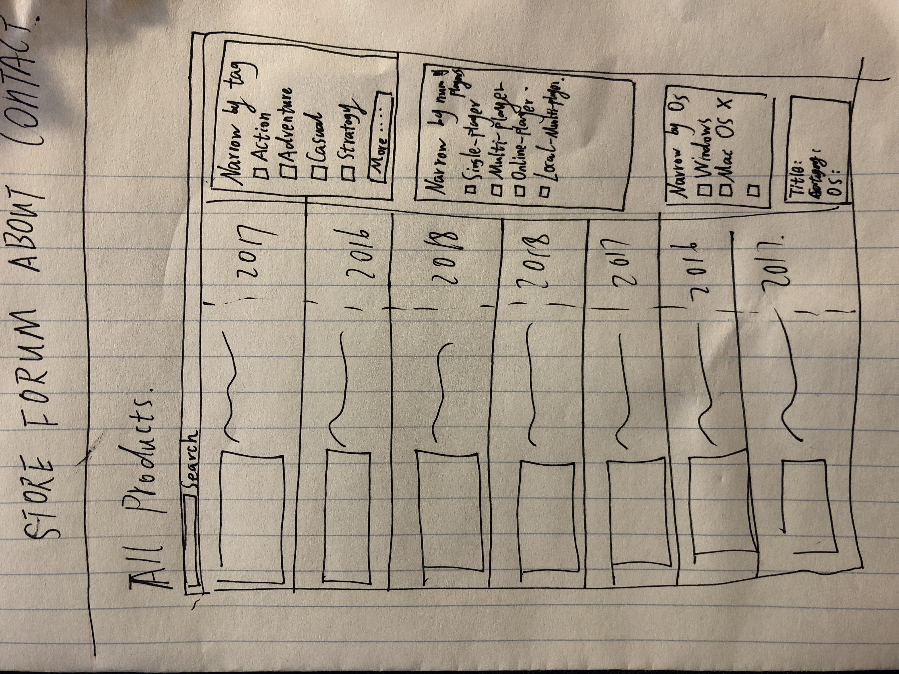
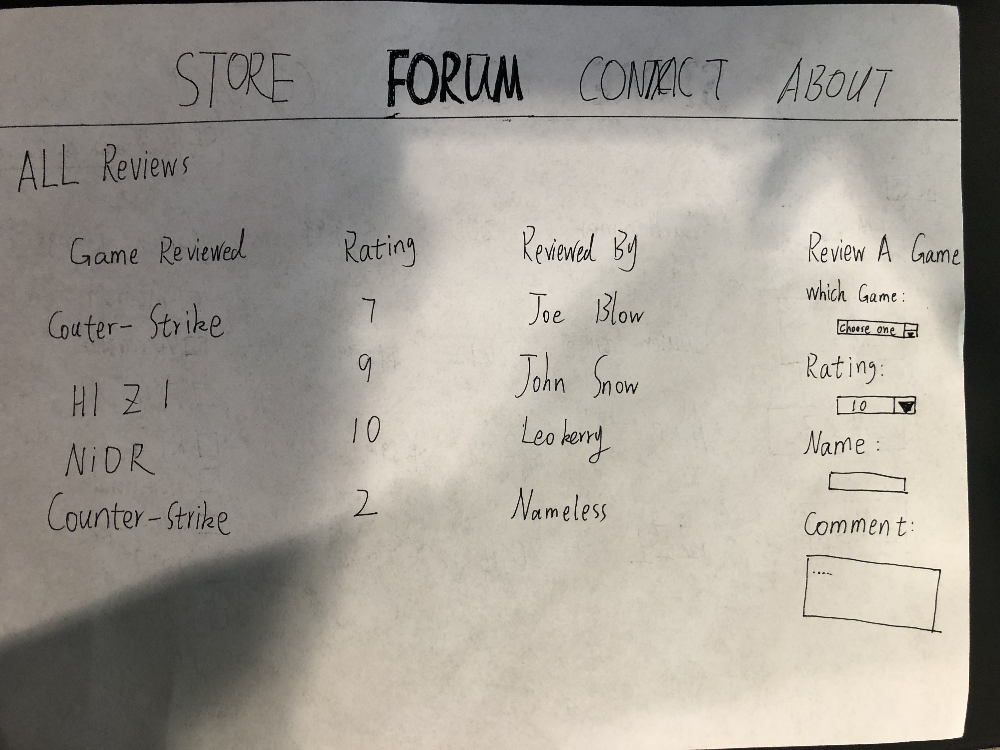
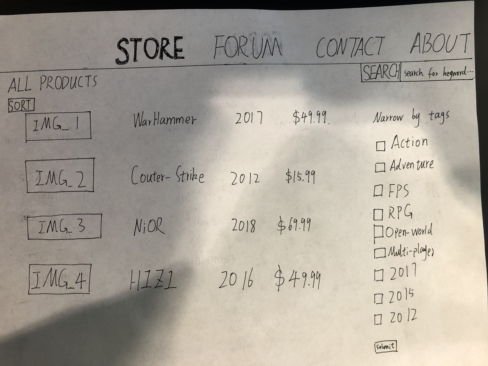

# Project 2, Milestone 1 - Design & Plan

Your Name:

## 1. Persona

I've selected **[Patrick]** as my persona.

I've selected my persona because Patrick tends to be a little more conservative comparing to other three personas.
He is risk averse, which means he does not like to play around with too many features on a page.
Therefore, designers have to make sure the website is very straightforward to use.
At last, Patrick likes to get a big picture first before he processes any further details.
When using a webpage based on database, a big picture seems important before user picks any filters.

## 2.Describe your Catalog

[What will your collection be about? What types of attributes (database columns) will you keep track of for the *things* in your collection? 1-2 sentences.]

My collection will be about video games with Steam as an example.
In this collection, I will keep track of title, year of publish, number of players, category, and OS.

## 3. Sketch & Wireframe

[Insert your 1 sketch here.]

[Insert your 1 wireframe here.]

[Explain why your design would be effective for your persona. 1-3 sentences.]
By listing most entries by name on one single page, such design is effective for Patrick in a way that it allows Patrick to collect information all at once. At the same time, the sidebars with function to further narrow down searching results present a very straightforward look Patrick wants to further narrow down.

## 4. Database Schema Design

[Describe the structure of your database. You may use words or a picture. A bulleted list is probably the simplest way to do this.]

Table: games
* pics: image of each game
* name: name of each game
* release_time: the date when each game was released
* price: the price of each game
* category: category of each student
* os: which OS each game will adopt
* num_player: number of players each game support

## 5. Database Query Plan

[Plan your database queries. You may use natural language, pseudocode, or SQL.]

1. All records
SELECT * FROM games

2. Search records by user selected field
* This is to show all the games
SELECT name FROM games
* This is to show the categories
SELECT category FROM games

3. Insert record
* To insert a new game's Name
INSERT INTO games (name) VALUES ('a fake name')
* To insert a new game's category
INSERT INTO games (category) ('action')

## 6. *Filter Input, Escape Output* Plan

[Describe your plan for filtering the input from your HTML forms. Describe your plan for escaping any values that you use in HTML or SQL. You may use natural language and/or pseudocode.]
* For search bar by:
  this will be filter by htmlspecialchars
* For search bar by year:
  this textare can only be typed in with four digits of integers.
* For Data Entry Form
  users would be able to have four inputs to give a preference for what video games they wish this website should include.
  Therefore, they are expected to give out name, year, category, and OS.
  In order to secure this HTML form, name will be an input filtered by only string and htmlspecialchars. Year will be defeinitly in a format of 4 digits, and category will be a drop down menu.

## 7. Additional Code Planning

**I know we should have a place for users to see all fields in the database.
However, I chose to only show four fields on my Store page on purpose because other fields are designed for search purposes. For example, field category is designed to contain tags so that it can searched by tags. Therefore, I do not intend to show that field on Store's table.
